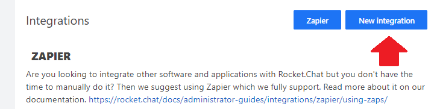

# OpenShift Meta Template
 
OpenShift Meta Template is an effort to bootstrap in a full [openshift](https://www.openshift.com) build pipeline in the [BCGov](https://github.com/bcgov) space with minimal upfront effort. The idea is being able to configure everything upfront and have what you need get spun up and created. Really handy in MicroService development.
 

 
Features includes:
 
- Build S2I from standard `nodeJS`/`.NET`/`Java` source code repository
- Setup for Infrastructure As Code, but will create BuildConfig/DeploymentConfig/Route/Service objects if they don't yet exist in your repo
- Configure Build and Deployment pod Resources (Time Limited Resource Pool)
- LifeCycle Webhook used to deliver caught Pipeline Exceptions
 
## Getting Started
 
Deploy a jenkins server using `BC Gov Pathfinder Jenkins (Persistent)` image from the service catalog.
 
If you're building a Dotnet application, deploy the appropriate Jenkins slave:
- [dotnet core](openshift/meta-templates/build-slaves/dotnet-slave.yaml)
 
Click import YAML in openshift tools namespace
 
paste [contents](https://raw.githubusercontent.com/ChrisHoban/ssg-openshift-meta-templates/master/openshift/meta-templates/pipeline-build-template.yaml) of /openshift/meta-templates/pipeline-build-template.yaml
 
Fill out requested parameters 

## Rocket Chat Integration

If you would like to integrate Rocket Chat Webhooks to allow people outside of Openshift to monitor the progress of deployments, please complete the following:

1. When signed into Rocket Chat, click on the following buttons:

2. Complete the form, ensuring that you choose the proper channel for your Pipeline Messages to be sent to.

The value displayed in the "Webhook URL" feed will be the value inserted into the LIFECYCLE_WEBHOOK variable in your pipeline when Rocket Chat reporting is enabled.

 
## Upcoming Features!
 
- SonarQube scanning for any project
- LifeCycle WebHooks
- HealthCheck Configs
- One Time Bootstrap Tools Services
      - Deploy and Configure Jenkins
      - Deploy and Configure SonarQube
      - Network Security Policy Configuration
      - image puller role for dev/test/prod namespace default user for tools namespace imagestream deployments
 
## Notes
 
- Current tool requires the following is already done before it works (Future versions will work on a blank slate): 
  1. Persistent Jenkins Template installed
  2. Network Security Policies loosened (Template to do so contained within)
  3. default user for dev/test/prod has image:puller role in tools namespace
 
- Pipeline build comes with jenkinsfile inline, for rapid prototyping before eventually placing pipeline in your repository.
 
## Contributing
 
If you want to discuss a new feature or found a bug, please open a new [issue here](https://github.com/ChrisHoban/ssg-openshift-meta-templates/issues).